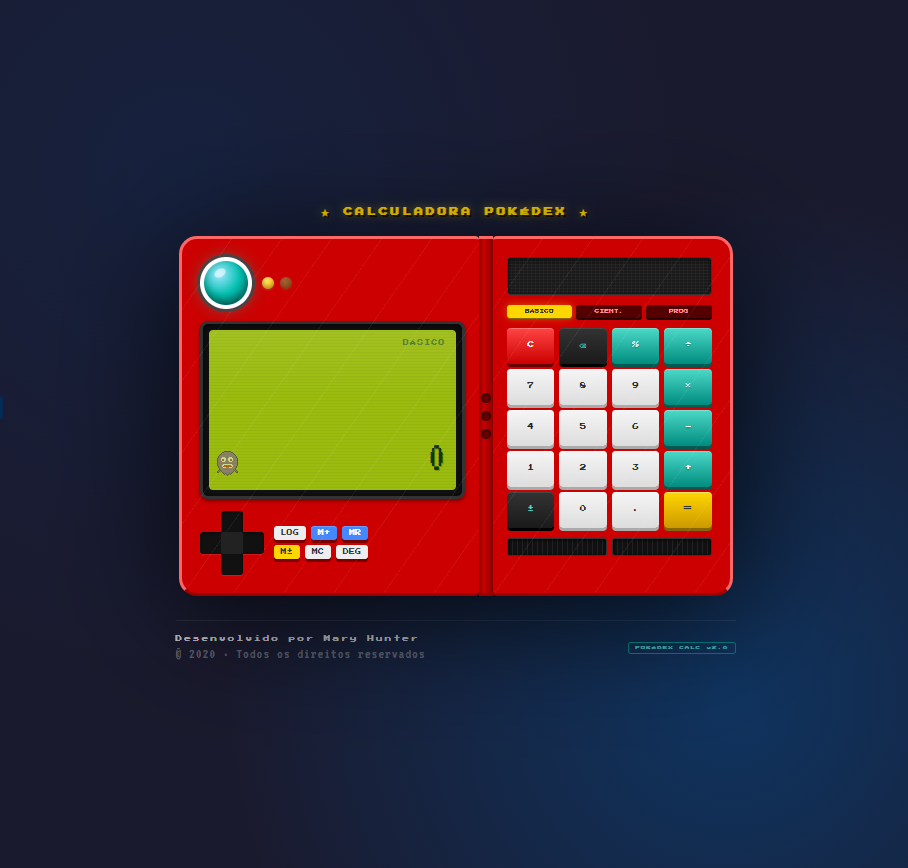

# 🎮 Calculadora Pokédex

> Projeto acadêmico desenvolvido em 2020 durante a graduação. O professor enviou o desafio e eu resolvi dar um toque especial — transformar uma calculadora comum em uma Pokédex funcional.

---

## 📸 Preview

<div align="center">
  
</div>

---

## 📖 Sobre o Projeto

A **Calculadora Pokédex** nasceu de um desafio proposto pelo professor na disciplina de Desenvolvimento Web. O requisito era simples: criar uma calculadora funcional em um único arquivo HTML. Resolvi ir além e recriar visualmente uma Pokédex clássica da franquia Pokémon, com todos os detalhes: lente azul, painel vermelho, dobradiça, tela estilo Game Boy e até um Gengar em pixel art para me representar.

O projeto foi desenvolvido **do zero**, sem frameworks ou bibliotecas externas além das fontes do Google Fonts.

---

## ✨ Funcionalidades

- **Modo Básico** — operações de adição, subtração, multiplicação e divisão
- **Modo Científico** — seno, cosseno, tangente, logaritmos, raízes, potências, fatorial, constantes (π, e) e muito mais
- **Modo Programador** — conversão entre HEX, DEC, OCT e BIN; operadores bitwise AND, OR, XOR, NOT e shift
- **Memória** — M+, MR, M± e MC
- **Histórico de cálculos** — log dos últimos 20 resultados com opção de reutilizar valores
- **Alternância DEG/RAD** — para cálculos trigonométricos
- **Suporte ao teclado físico** — digite normalmente pelo teclado do computador
- **Pixel art do Gengar** — meu Pokémon favorito, animado na tela ✨
- **Design responsivo** — adaptado para telas menores

---

## 🛠️ Tecnologias

| Tecnologia | Uso |
|---|---|
| HTML5 | Estrutura e canvas (pixel art) |
| CSS3 | Design da Pokédex, animações e responsividade |
| JavaScript (Vanilla) | Lógica da calculadora e interatividade |
| Google Fonts | Press Start 2P + VT323 (fontes pixel) |

---

## 🚀 Como Usar

PODE ACESSAR TAMBÉM PELO LINK: https://maryhunter177-jpg.github.io/Calculadora-dex/

Não precisa instalar nada. Basta abrir o arquivo no navegador:

```bash
# Clone o repositório
git clone [https://github.com/maryhunter177-jpg/Calculadora-dex.git](https://github.com/maryhunter177-jpg/Calculadora-dex.git)

# Entre na pasta
cd Calculadora-dex

# Abra o arquivo no navegador
# No Windows:
start calculadora-pokedex.html
# No Mac/Linux:
open calculadora-pokedex.html

💡 Contexto Acadêmico
Instituição: [Anhanguera]

Disciplina: Desenvolvimento Web

Ano: 2020

Desafio proposto pelo professor: criar uma calculadora funcional em HTML/CSS/JS puro, em um único arquivo

👩‍💻 Desenvolvedora
Mary Hunter Feito com 💜 e muito café em 2020.
